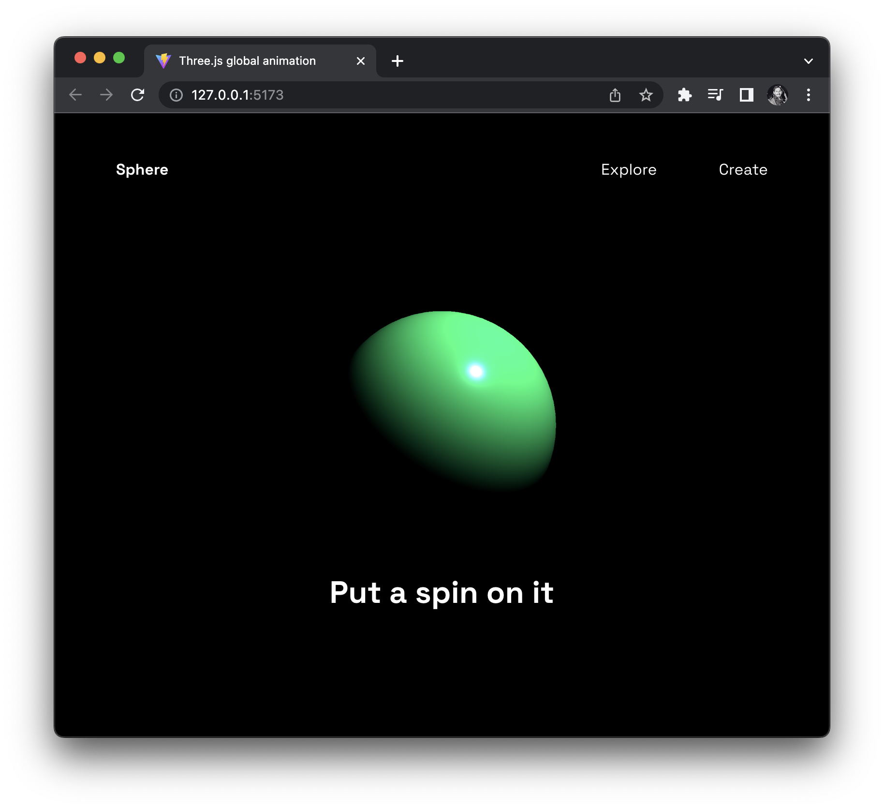

## A sphere with Three.js

> A sphere object that is animated with a `gsap` timeline.



Featuring:

- A `THREE` scene that has a `SphereGeometry` instance added. For more information see comments in `main.js`.

1. Creating the movie `scene` instance of `Scene` 🎭
2. Instantiate a `SphereGeometry` instance called `geometry` 📦
3. The `PerspectiveCamera` presents our field of view "FOV" 🎥
4. Rendering "painting to screen" we use `WebGLRenderer` 🎬
5. `PointLight` to see something on your "movie set" `scene` 🔦
6. Controlling the camera around the target we use `OrbitControls` 🕹️

- `gsap` is used to animate a bit of UI and the sphere mesh `THREE.Color`

```js
/* # https://greensock.com/docs/v3/GSAP/Timeline
A Timeline is a powerful sequencing tool that acts as a container for tweens and other timelines, making it simple to control them as a whole and precisely manage their timing. Without Timelines, building complex sequences would be far more cumbersome because you'd need to use a delay for every animation. And what if you want to `pause` the whole sequence or `restart` or `reverse` on the fly? This could become quite messy, but GSAP's Timelines make it simple: */
const tl = gsap.timeline({ defaults: { duration: 1 } });
tl.fromTo(mesh.scale, { z: 0, x: 0, y: 0 }, { z: 1, x: 1, y: 1 });
tl.fromTo("nav", { y: "-100%" }, { y: "0%" });
tl.fromTo(".title", { opacity: 0 }, { opacity: 1 });

// Color animation 🎨:
let mouseDown = false;
let rgb = [];

window.addEventListener("mousedown", () => (mouseDown = true));
window.addEventListener("mouseup", () => (mouseDown = false));
window.addEventListener("mousemove", (e) => {
  if (mouseDown) {
    // Produces a range between 0 and 255 when the mouse moves horizontally
    rgb = [
      Math.round((e.pageX / sizes.width) * 255),
      Math.round((e.pageY / sizes.height) * 255),
      150,
    ];
    // console.log(rgb);
    // console.log(`rgb(${rgb.join(",")})`);
    let changeColor = new THREE.Color(`rgb(${rgb.join(",")})`);
    gsap.to(mesh.material.color, {
      r: changeColor.r,
      g: changeColor.g,
      b: changeColor.b,
    });
  }
});
```

Regards, <br />
Luigi Lupini <br />
<br />
I ❤️ all things (🇮🇹 / 🛵 / ☕️ / 👨‍👩‍👧)<br />
